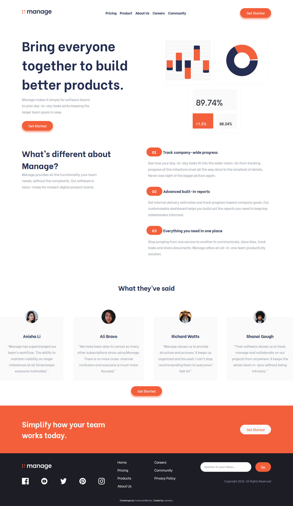

# Manage Landing Page

This is my personal solution for the pricing-component challenge by Frontend Mentor.

You can see the live version [here](https://pricing-component.xstrafez.now.sh/ 'pricing-component')

### Interactions

**On mobile / tablet**

- Click on the menu to see the links and on the x to close it
- Click on the slider dots to display the corresponding testimonial

## Results

|             Mobile version             |             Desktop version             |
| :------------------------------------: | :-------------------------------------: |
|  |  |

## See also

[Link to the challenge](https://www.frontendmentor.io/challenges/manage-landing-page-SLXqC6P5)
